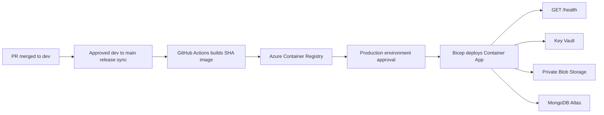

# Azure Container Apps Deployment

This guide deploys LibreChat as a stateless Azure Container App. MongoDB Atlas on Azure stores application data and private Azure Blob Storage holds uploaded files. It intentionally excludes the Compose-only MongoDB, Meilisearch, pgvector, RAG, and admin-panel services.



## What Gets Created

[main.bicep](../infra/main.bicep) creates an Azure Container Registry, Container Apps environment, Log Analytics workspace, Key Vault, private Storage Account container, app managed identity, and GitHub Actions managed identity. The Container App is created after the first image is in ACR.

The app identity receives `AcrPull`, Storage Blob Data Contributor, and Key Vault Secrets User. The GitHub Actions identity receives `Contributor` on the resource group and `AcrPush` on the registry. These role assignments are created only by the bootstrap deployment.

## Naming Standard

Choose one immutable environment suffix. This guide uses `prod01` as its concrete production example. The Bicep template lowercases the supplied suffix, so use only lowercase letters and numbers. It must be 4-12 characters and be globally unique where Azure requires it.

Create the resource group outside Bicep with this exact name:

```bash
export RESOURCE_GROUP=rg-librechat-prod-eastus
export LOCATION=eastus
export RESOURCE_SUFFIX=prod01
```

With `RESOURCE_SUFFIX=prod01`, the Bicep deployment creates these exact Azure resource names:

| Purpose | Azure resource type | Exact name |
| --- | --- | --- |
| Resource group | `Microsoft.Resources/resourceGroups` | `rg-librechat-prod-eastus` |
| Container Apps environment | `Microsoft.App/managedEnvironments` | `lcprod01-cae` |
| LibreChat Container App | `Microsoft.App/containerApps` | `lcprod01-app` |
| Container Registry | `Microsoft.ContainerRegistry/registries` | `lcprod01acr` |
| Log Analytics workspace | `Microsoft.OperationalInsights/workspaces` | `lcprod01-logs` |
| Key Vault | `Microsoft.KeyVault/vaults` | `lcprod01-kv` |
| Storage account | `Microsoft.Storage/storageAccounts` | `lcprod01store` |
| Blob container | `Microsoft.Storage/storageAccounts/blobServices/containers` | `files` |
| LibreChat app identity | `Microsoft.ManagedIdentity/userAssignedIdentities` | `lcprod01-app-id` |
| GitHub deployment identity | `Microsoft.ManagedIdentity/userAssignedIdentities` | `lcprod01-github-id` |
| GitHub OIDC credential | Federated credential | `github-main` |
| GitHub OIDC credential | Federated credential | `github-production` |

The registry login server is `lcprod01acr.azurecr.io`. The Container Apps URL is generated by Azure and must be read from the `containerAppUrl` Bicep output after the first application deployment.

### MongoDB Atlas Names

MongoDB Atlas is a separate SaaS control plane, even when its cluster runs in Azure. It is not an Azure ARM resource and [main.bicep](../infra/main.bicep) cannot create its Atlas project, cluster, database user, or network access entry. Create the following exact Atlas objects in the selected Atlas organization:

| Atlas object | Exact name/value |
| --- | --- |
| Project | `librechat-production` |
| Cloud provider | Azure |
| Region | `EAST_US` for `eastus`; use the Atlas Azure region matching `LOCATION` otherwise |
| Cluster | `librechat-prod01` |
| Database | `LibreChat` |
| Database user | `librechat_app` |
| Network access entry label | `azure-container-apps-prod01` |

Grant `librechat_app` `readWrite` on the `LibreChat` database. Atlas may require an `admin`-database authentication source in its generated connection URI; use the URI Atlas supplies unchanged. Store it as `MONGO_URI`, for example:

```text
mongodb+srv://librechat_app:<url-encoded-password>@librechat-prod01.<atlas-id>.mongodb.net/LibreChat?retryWrites=true&w=majority
```

The temporary public Container Apps design does not expose fixed outbound IPs suitable for a narrow Atlas allowlist. For the first deployment, Atlas must permit the environment's traffic according to your Atlas network policy. Replace this with VNet-integrated Container Apps and Atlas private connectivity before production data is exposed.

## Prerequisites

- An Azure subscription where you can create a resource group, user-assigned managed identities, Key Vault, Container Apps, and role assignments. The bootstrap principal needs `Owner` or `User Access Administrator` plus deployment permission at the resource-group scope.
- Azure CLI with Bicep available:

  ```bash
  az version
  az bicep install
  ```

- MongoDB Atlas deployed in Azure, the `librechat-production` project, `librechat-prod01` cluster, `LibreChat` database, `librechat_app` database user, and its connection URI. Change the `prod01` names consistently if you choose another suffix.
- A GitHub repository using this code and a protected `production` GitHub Environment.
- A unique suffix of 4-12 lowercase letters or numbers. It becomes part of globally unique Azure resource names.

## 1. Prepare MongoDB Atlas

1. Create an Atlas project and Azure-backed cluster.
2. Create a non-owner database user for LibreChat and copy its `mongodb+srv://...` connection URI.
3. Configure Atlas network access before the first app revision. The initial public Container Apps environment may need a temporary broad access rule. Replace it with VNet/private connectivity before handling sensitive production data.
4. Verify the URI connects from an approved network. Store the unmodified URI as `MONGO_URI`; do not URL-decode credentials.

## 2. Bootstrap Azure

Run this once from the repository root on a trusted machine. It creates the foundation but does not attempt to create an app with a nonexistent image.

```bash
export RESOURCE_GROUP=rg-librechat-prod-eastus
export LOCATION=eastus
export RESOURCE_SUFFIX=prod01
export GITHUB_REPOSITORY=<github-owner>/<github-repository>

az login
az group create --name "$RESOURCE_GROUP" --location "$LOCATION"

az deployment group create \
  --name librechat-bootstrap \
  --resource-group "$RESOURCE_GROUP" \
  --template-file infra/main.bicep \
  --parameters \
    location="$LOCATION" \
    resourceSuffix="$RESOURCE_SUFFIX" \
    githubRepository="$GITHUB_REPOSITORY" \
    deployApp=false \
    assignAppRoles=true \
    assignDeploymentRoles=true \
    mongoUri='<mongodb-atlas-uri>' \
    credsKey="$(openssl rand -hex 32)" \
    credsIv="$(openssl rand -hex 16)" \
    jwtSecret="$(openssl rand -hex 32)"
```

Record the deployment outputs without exposing secret values:

```bash
az deployment group show \
  --resource-group "$RESOURCE_GROUP" \
  --name librechat-bootstrap \
  --query properties.outputs -o json
```

You need `containerRegistryName` and `deploymentIdentityClientId` for GitHub configuration. The output also lists every Azure resource name in the naming table above. Key Vault retains the initial secret values, but CI must be given the same values to preserve them on every declarative deployment.

## 3. Configure GitHub

Create an environment named `production` in **Settings > Environments**. Set its required reviewers before enabling automatic deployment.

In **Settings > Secrets and variables > Actions > Variables**, create these repository variables:

| Variable | Value |
| --- | --- |
| `AZURE_CLIENT_ID` | Bicep output `deploymentIdentityClientId` |
| `AZURE_TENANT_ID` | `az account show --query tenantId -o tsv` |
| `AZURE_SUBSCRIPTION_ID` | `az account show --query id -o tsv` |
| `AZURE_RESOURCE_GROUP` | `rg-librechat-prod-eastus` |
| `AZURE_LOCATION` | `$LOCATION` |
| `AZURE_RESOURCE_SUFFIX` | `prod01` |
| `AZURE_CONTAINER_REGISTRY_NAME` | `lcprod01acr` |

In the `production` environment, create these secrets:

| Secret | Value |
| --- | --- |
| `MONGO_URI` | Atlas URI used during bootstrap |
| `CREDS_KEY` | Bootstrap encryption key, 64 hex characters |
| `CREDS_IV` | Bootstrap encryption IV, 32 hex characters |
| `JWT_SECRET` | Bootstrap JWT signing secret, 64 hex characters |

Do not configure `AZURE_CREDENTIALS`. Both workflows authenticate using GitHub OIDC and the Bicep-created federated identity. Never rotate `CREDS_KEY` or `CREDS_IV` casually: existing encrypted LibreChat credentials depend on them.

## 4. First Deployment

Run **Azure Container Registry Build** manually from the `main` branch, or push a qualifying change to `main`. It builds `Dockerfile`, pushes `librechat:<full-commit-sha>` to ACR, and produces SBOM/provenance metadata.

The successful build triggers **Azure Container Apps Deploy**. Approve the pending `production` environment deployment. It checks out the same commit, deploys that exact SHA through Bicep, and waits for `https://<generated-fqdn>/health`.

Get the application URL:

```bash
APP_NAME="lc${RESOURCE_SUFFIX}-app"
az containerapp show \
  --name "$APP_NAME" \
  --resource-group "$RESOURCE_GROUP" \
  --query properties.configuration.ingress.fqdn -o tsv
```

Open `https://<fqdn>`, create the initial account, test a configured model provider, and upload/download a file.

## 5. Normal Release Flow

1. Open a PR targeting `dev`; [azure-infrastructure.yml](../.github/workflows/azure-infrastructure.yml) compiles Bicep when infrastructure or Azure workflow files change.
2. Merge the PR after required checks pass.
3. Complete the approved release sync from `dev` to `main`.
4. The `main` push builds an immutable image, then automatically opens a protected production deployment.
5. Approve the GitHub Environment deployment. Azure deploys the revision and the workflow succeeds only after `/health` responds successfully.

This repository uses `main` as the production release boundary. A merge into `dev` alone does not deploy production.

## Runtime Configuration and Storage

The Container App mounts [librechat.azure.yaml](../infra/librechat.azure.yaml) at `CONFIG_PATH=/app/config/librechat.yaml`:

```yaml
version: 1.3.16
fileStrategies:
  avatar: azure_blob
  image: azure_blob
  document: azure_blob
  skills: azure_blob
```

The application uses `AZURE_STORAGE_ACCOUNT_NAME` with its managed identity. Do not set `AZURE_STORAGE_CONNECTION_STRING`. The `files` container is private, and LibreChat authorizes downloads through its application routes.

## Verify and Operate

Check revision state and logs:

```bash
az containerapp revision list \
  --name "$APP_NAME" \
  --resource-group "$RESOURCE_GROUP" \
  -o table

az containerapp logs show \
  --name "$APP_NAME" \
  --resource-group "$RESOURCE_GROUP" \
  --follow
```

Validate health independently:

```bash
APP_FQDN=$(az containerapp show --name "$APP_NAME" --resource-group "$RESOURCE_GROUP" --query properties.configuration.ingress.fqdn -o tsv)
curl --fail --show-error "https://${APP_FQDN}/health"
```

## Roll Back

Find a prior immutable image tag in ACR, then manually run **Azure Container Apps Deploy** with that full 40-character commit SHA as `image_tag`. The deployment workflow redeploys the selected immutable image and repeats the health check.

```bash
az acr repository show-tags \
  --name <container-registry-name> \
  --repository librechat \
  --orderby time_desc \
  -o table
```

## Troubleshooting

| Symptom | Check |
| --- | --- |
| Azure login fails in Actions | Confirm all `AZURE_*` repository variables and the repository/branch/environment match the Bicep federated identity subjects. |
| ACR push fails | Confirm bootstrap completed with `assignDeploymentRoles=true` and the GitHub identity has `AcrPush`. |
| Revision cannot start | Inspect Container App logs, confirm Key Vault secret references resolve, and verify Atlas network access and URI. |
| `/health` never succeeds | Confirm Atlas connectivity first; LibreChat connects to MongoDB before serving the health route. |
| Blob uploads fail | Confirm `AZURE_STORAGE_ACCOUNT_NAME` is present, no connection string overrides it, and the app identity retains Storage Blob Data Contributor. |
| CI attempts role assignment | Ensure deployment workflow parameters set both `assignAppRoles=false` and `assignDeploymentRoles=false`. |

## Next Production Hardening

Add VNet integration, Atlas private connectivity, custom-domain TLS behind Front Door Premium with WAF, private endpoints, alert rules, backups, and a staging environment before scaling to sensitive or high-volume usage. Design RAG separately with managed PostgreSQL plus `pgvector` and a dedicated Container App; do not lift the stateful Compose services into the autoscaled runtime.